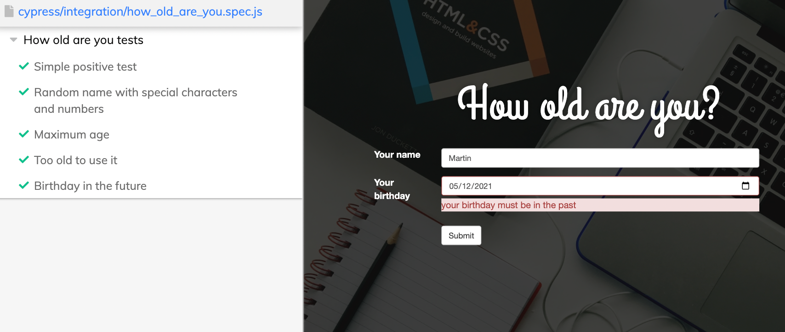

# HowOldAreYouTests

## Description

This repo is an example spec in Cypress to test the "How old are you" application. 

### Application description

Link to the application: https://howoldryou.000webhostapp.com/

The application accepts username and date of birth as input. After pressing the Submit button, it shows the age of the user.

## Usage

You can invoke the command from your project root like so:
```bash
npm run open
```
and Cypress will open 

You should have Node.js 12 or 14 and above.

## Installation

To learn how to install and write tests on Cypress, use the documentation:
https://docs.cypress.io/guides

## Important note

These are not all tests required to complete test this application.
There are only 5 test cases as a Cypress usage example.


